## ui-interface

 -  - `<Icon group="ui-interface" name="monitor" />`
 -  - `<Icon group="ui-interface" name="smile-1" />`
 - 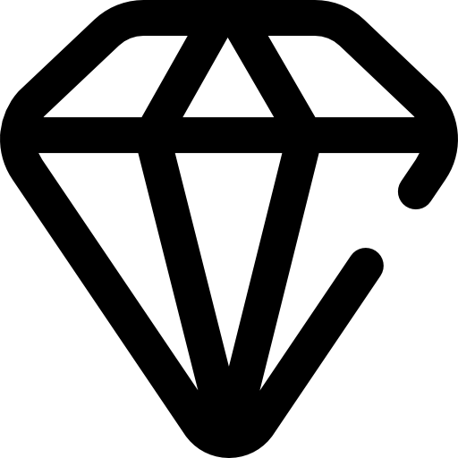 - `<Icon group="ui-interface" name="diamond" />`
 -  - `<Icon group="ui-interface" name="bar-chart" />`
 -  - `<Icon group="ui-interface" name="wifi" />`
 -  - `<Icon group="ui-interface" name="key" />`
 - 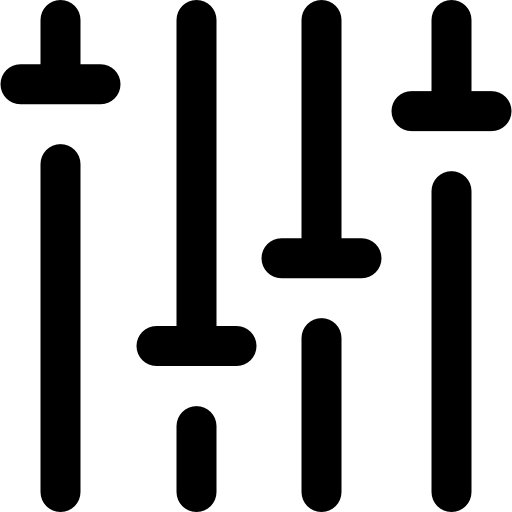 - `<Icon group="ui-interface" name="equalizer" />`
 -  - `<Icon group="ui-interface" name="credit-card" />`
 -  - `<Icon group="ui-interface" name="share" />`
 -  - `<Icon group="ui-interface" name="loading" />`
 -  - `<Icon group="ui-interface" name="instagram" />`
 - 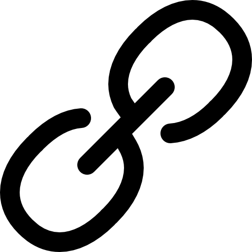 - `<Icon group="ui-interface" name="link" />`
 -  - `<Icon group="ui-interface" name="broken-link" />`
 -  - `<Icon group="ui-interface" name="smile" />`
 - 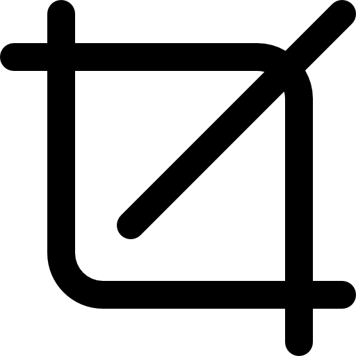 - `<Icon group="ui-interface" name="crop" />`
 -  - `<Icon group="ui-interface" name="sad" />`
 -  - `<Icon group="ui-interface" name="cursor" />`
 -  - `<Icon group="ui-interface" name="remove-user" />`
 -  - `<Icon group="ui-interface" name="add-user" />`
 -  - `<Icon group="ui-interface" name="pause" />`
 -  - `<Icon group="ui-interface" name="stop" />`
 -  - `<Icon group="ui-interface" name="play" />`
 - 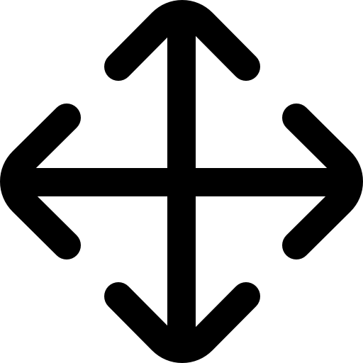 - `<Icon group="ui-interface" name="move" />`
 - 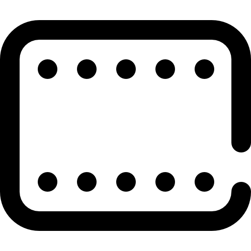 - `<Icon group="ui-interface" name="video" />`
 -  - `<Icon group="ui-interface" name="rewind" />`
 - 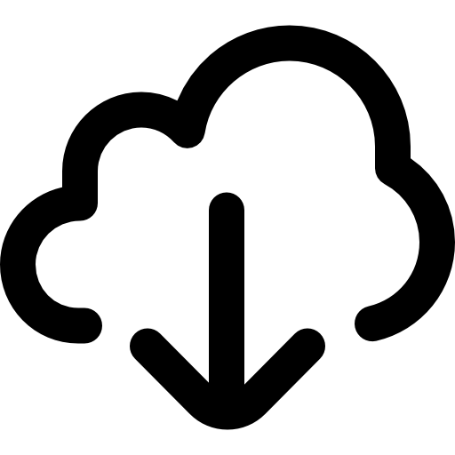 - `<Icon group="ui-interface" name="cloud-computing-1" />`
 - 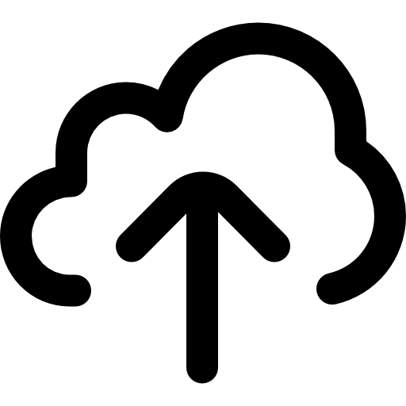 - `<Icon group="ui-interface" name="cloud-computing" />`
 -  - `<Icon group="ui-interface" name="user-1" />`
 -  - `<Icon group="ui-interface" name="star" />`
 -  - `<Icon group="ui-interface" name="facebook" />`
 -  - `<Icon group="ui-interface" name="cloud" />`
 -  - `<Icon group="ui-interface" name="briefcase" />`
 - 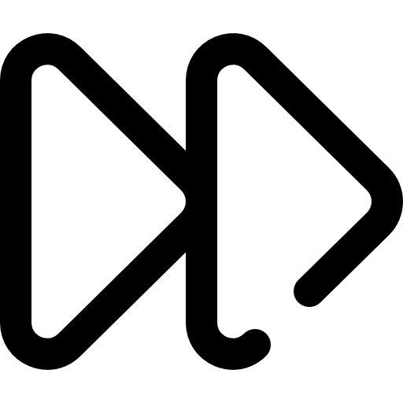 - `<Icon group="ui-interface" name="fast-forward" />`
 -  - `<Icon group="ui-interface" name="cancel" />`
 - 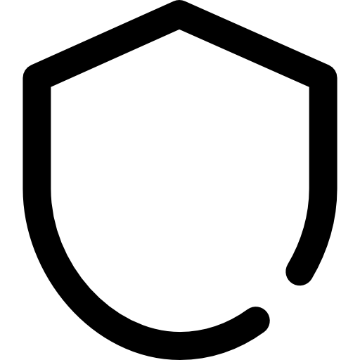 - `<Icon group="ui-interface" name="shield" />`
 -  - `<Icon group="ui-interface" name="calculator" />`
 -  - `<Icon group="ui-interface" name="photo-camera" />`
 -  - `<Icon group="ui-interface" name="cut-1" />`
 - 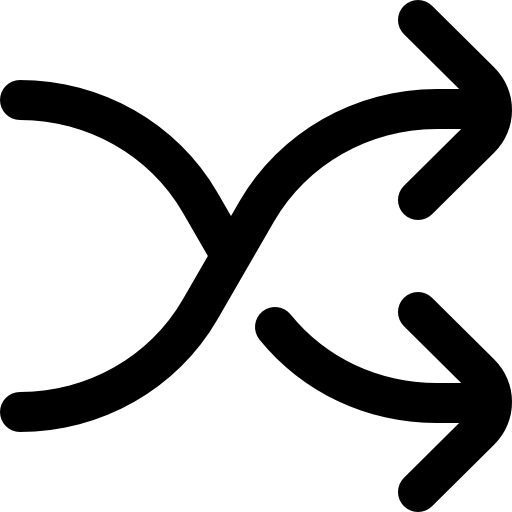 - `<Icon group="ui-interface" name="shuffle" />`
 -  - `<Icon group="ui-interface" name="compass" />`
 -  - `<Icon group="ui-interface" name="folder" />`
 -  - `<Icon group="ui-interface" name="minus" />`
 -  - `<Icon group="ui-interface" name="plus" />`
 -  - `<Icon group="ui-interface" name="file" />`
 -  - `<Icon group="ui-interface" name="align-right" />`
 - 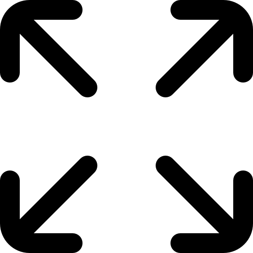 - `<Icon group="ui-interface" name="expand" />`
 -  - `<Icon group="ui-interface" name="earth-grid" />`
 -  - `<Icon group="ui-interface" name="justify" />`
 -  - `<Icon group="ui-interface" name="copy" />`
 - 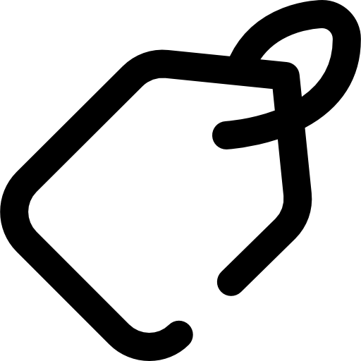 - `<Icon group="ui-interface" name="tag" />`
 -  - `<Icon group="ui-interface" name="minimize" />`
 - 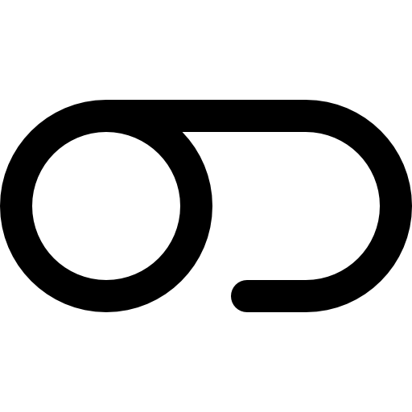 - `<Icon group="ui-interface" name="switch-1" />`
 -  - `<Icon group="ui-interface" name="heart" />`
 -  - `<Icon group="ui-interface" name="clip" />`
 -  - `<Icon group="ui-interface" name="cube" />`
 -  - `<Icon group="ui-interface" name="information" />`
 -  - `<Icon group="ui-interface" name="eye" />`
 -  - `<Icon group="ui-interface" name="hide" />`
 -  - `<Icon group="ui-interface" name="log-out" />`
 -  - `<Icon group="ui-interface" name="align-left" />`
 - 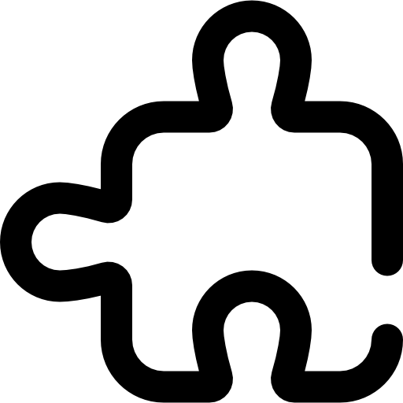 - `<Icon group="ui-interface" name="puzzle" />`
 -  - `<Icon group="ui-interface" name="switch" />`
 -  - `<Icon group="ui-interface" name="picture" />`
 -  - `<Icon group="ui-interface" name="pin-1" />`
 -  - `<Icon group="ui-interface" name="right-arrow-1" />`
 -  - `<Icon group="ui-interface" name="refresh" />`
 -  - `<Icon group="ui-interface" name="filter" />`
 -  - `<Icon group="ui-interface" name="pencil" />`
 -  - `<Icon group="ui-interface" name="log-in" />`
 -  - `<Icon group="ui-interface" name="reply-all" />`
 - 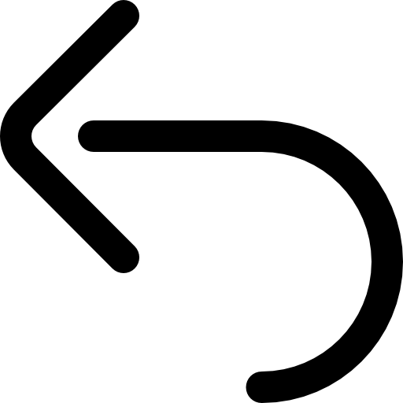 - `<Icon group="ui-interface" name="reply" />`
 -  - `<Icon group="ui-interface" name="silence" />`
 -  - `<Icon group="ui-interface" name="settings" />`
 -  - `<Icon group="ui-interface" name="email-2" />`
 -  - `<Icon group="ui-interface" name="left-arrow-2" />`
 -  - `<Icon group="ui-interface" name="email-1" />`
 -  - `<Icon group="ui-interface" name="menu-1" />`
 - 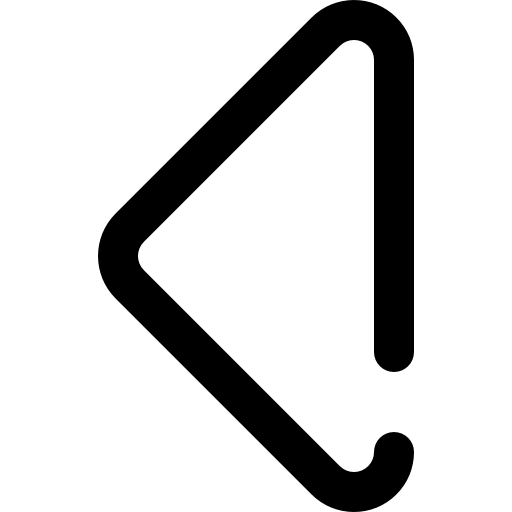 - `<Icon group="ui-interface" name="left-arrow-1" />`
 -  - `<Icon group="ui-interface" name="right-arrow" />`
 - 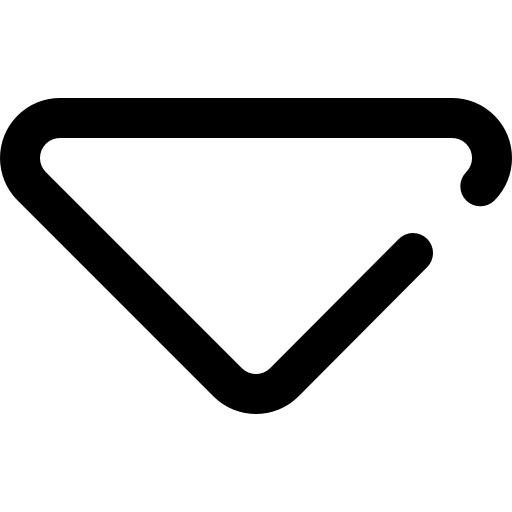 - `<Icon group="ui-interface" name="down-arrow-2" />`
 - 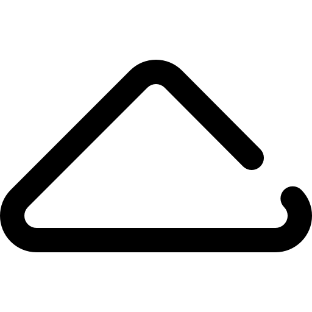 - `<Icon group="ui-interface" name="up-arrow-2" />`
 -  - `<Icon group="ui-interface" name="alarm-1" />`
 -  - `<Icon group="ui-interface" name="chevron" />`
 -  - `<Icon group="ui-interface" name="firefox" />`
 -  - `<Icon group="ui-interface" name="disabled" />`
 - 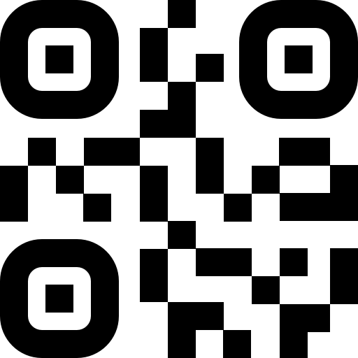 - `<Icon group="ui-interface" name="qr-code" />`
 - 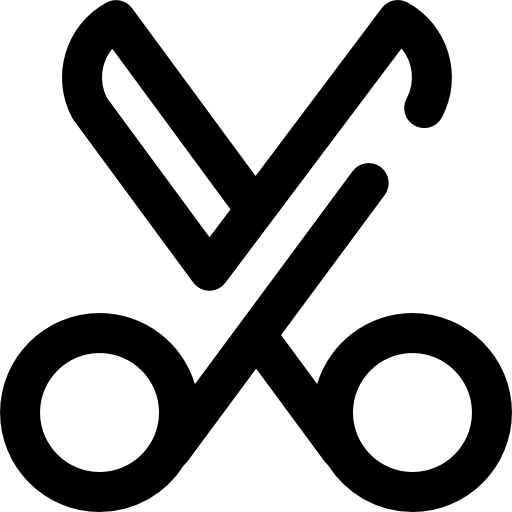 - `<Icon group="ui-interface" name="cut" />`
 - 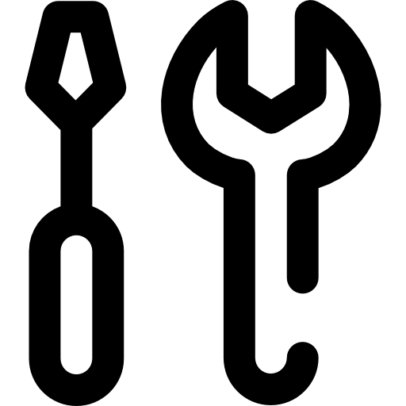 - `<Icon group="ui-interface" name="tools" />`
 - 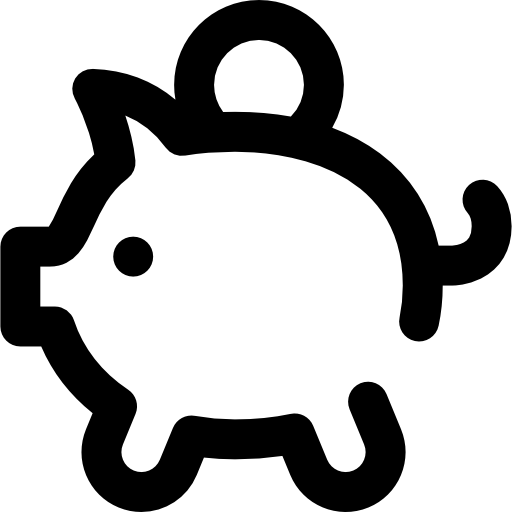 - `<Icon group="ui-interface" name="piggy-bank" />`
 - 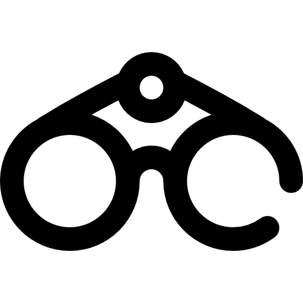 - `<Icon group="ui-interface" name="binoculars" />`
 -  - `<Icon group="ui-interface" name="shopping-cart" />`
 - 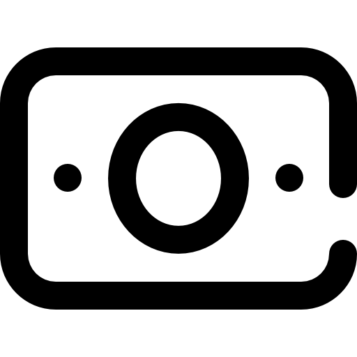 - `<Icon group="ui-interface" name="money" />`
 -  - `<Icon group="ui-interface" name="down-arrow-1" />`
 -  - `<Icon group="ui-interface" name="thermometer" />`
 -  - `<Icon group="ui-interface" name="umbrella" />`
 -  - `<Icon group="ui-interface" name="dashboard" />`
 -  - `<Icon group="ui-interface" name="pin" />`
 -  - `<Icon group="ui-interface" name="megaphone" />`
 -  - `<Icon group="ui-interface" name="youtube" />`
 - 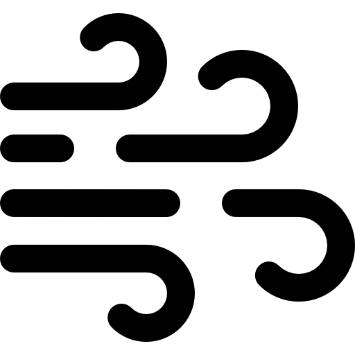 - `<Icon group="ui-interface" name="wind" />`
 -  - `<Icon group="ui-interface" name="safari" />`
 - 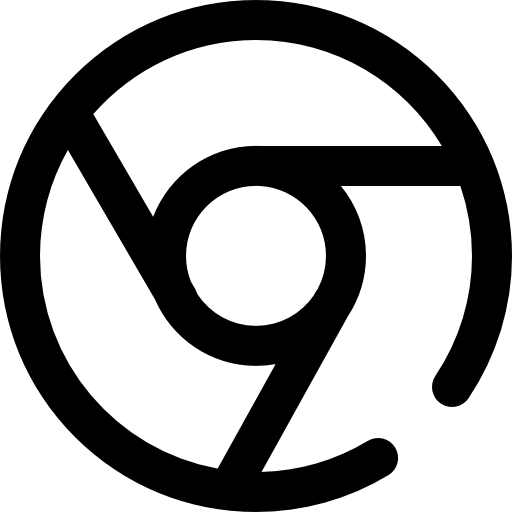 - `<Icon group="ui-interface" name="chrome" />`
 -  - `<Icon group="ui-interface" name="headphones" />`
 - 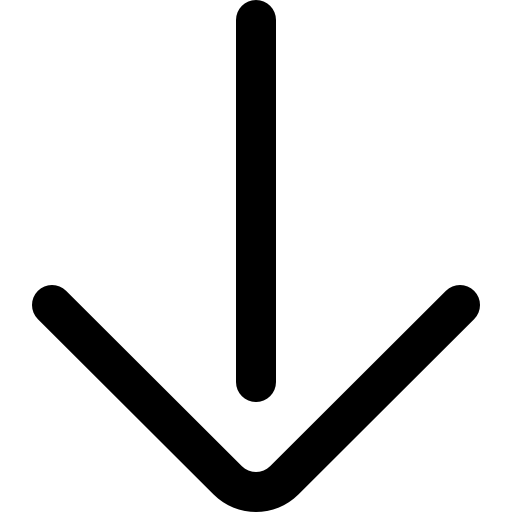 - `<Icon group="ui-interface" name="down-arrow" />`
 -  - `<Icon group="ui-interface" name="twitter" />`
 - 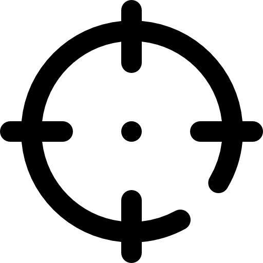 - `<Icon group="ui-interface" name="target" />`
 -  - `<Icon group="ui-interface" name="leaf" />`
 -  - `<Icon group="ui-interface" name="highlighter" />`
 - 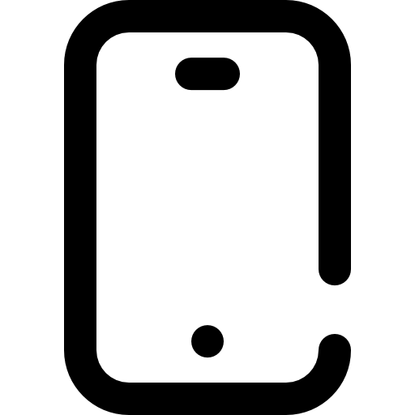 - `<Icon group="ui-interface" name="smartphone" />`
 -  - `<Icon group="ui-interface" name="screenshot" />`
 -  - `<Icon group="ui-interface" name="power-button" />`
 -  - `<Icon group="ui-interface" name="question" />`
 -  - `<Icon group="ui-interface" name="push-pin" />`
 - 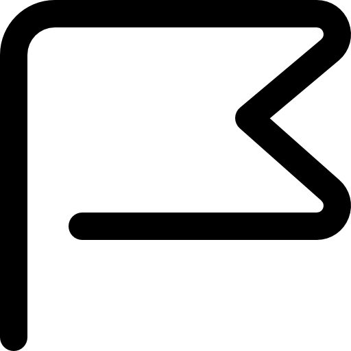 - `<Icon group="ui-interface" name="flag" />`
 -  - `<Icon group="ui-interface" name="left-arrow" />`
 -  - `<Icon group="ui-interface" name="moon" />`
 - 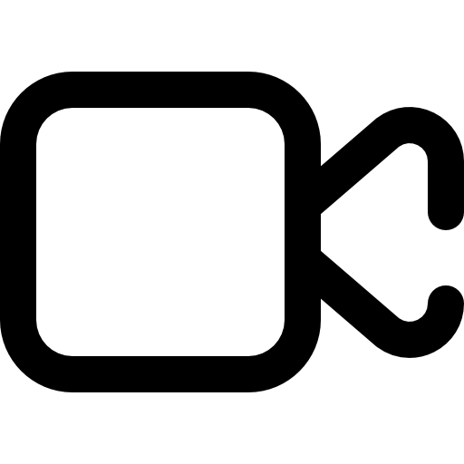 - `<Icon group="ui-interface" name="video-camera" />`
 -  - `<Icon group="ui-interface" name="music" />`
 -  - `<Icon group="ui-interface" name="printer" />`
 - 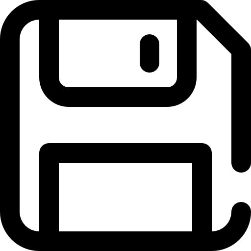 - `<Icon group="ui-interface" name="diskette" />`
 -  - `<Icon group="ui-interface" name="paste" />`
 -  - `<Icon group="ui-interface" name="mute-1" />`
 -  - `<Icon group="ui-interface" name="paint-bucket" />`
 -  - `<Icon group="ui-interface" name="clicker" />`
 -  - `<Icon group="ui-interface" name="dislike" />`
 -  - `<Icon group="ui-interface" name="up-arrow-1" />`
 -  - `<Icon group="ui-interface" name="like" />`
 -  - `<Icon group="ui-interface" name="straight" />`
 -  - `<Icon group="ui-interface" name="joke" />`
 -  - `<Icon group="ui-interface" name="surprise" />`
 -  - `<Icon group="ui-interface" name="scale" />`
 -  - `<Icon group="ui-interface" name="trash-1" />`
 -  - `<Icon group="ui-interface" name="trash" />`
 -  - `<Icon group="ui-interface" name="phone-call-2" />`
 -  - `<Icon group="ui-interface" name="phone-call-1" />`
 -  - `<Icon group="ui-interface" name="phone-call" />`
 -  - `<Icon group="ui-interface" name="eraser" />`
 -  - `<Icon group="ui-interface" name="thunderbolt" />`
 - 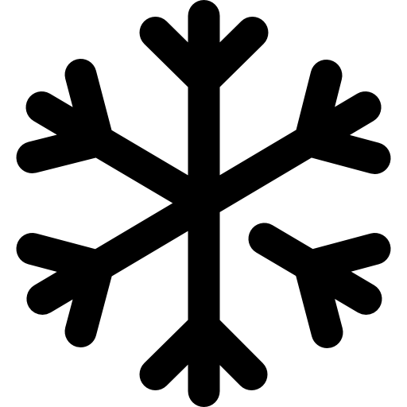 - `<Icon group="ui-interface" name="snowflake" />`
 -  - `<Icon group="ui-interface" name="sun" />`
 -  - `<Icon group="ui-interface" name="home" />`
 -  - `<Icon group="ui-interface" name="microphone" />`
 - 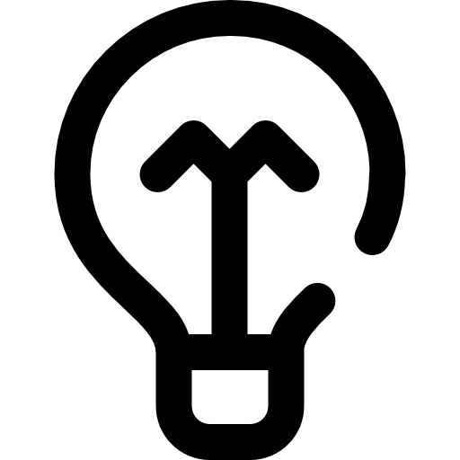 - `<Icon group="ui-interface" name="idea" />`
 -  - `<Icon group="ui-interface" name="layout" />`
 - 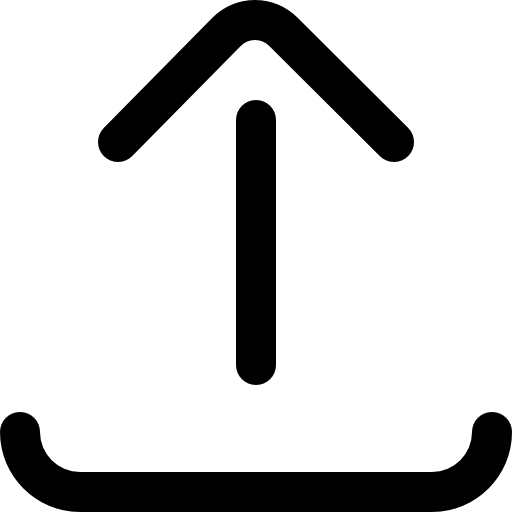 - `<Icon group="ui-interface" name="upload" />`
 -  - `<Icon group="ui-interface" name="download" />`
 -  - `<Icon group="ui-interface" name="medal" />`
 -  - `<Icon group="ui-interface" name="open-lock" />`
 -  - `<Icon group="ui-interface" name="diagram" />`
 -  - `<Icon group="ui-interface" name="pie-chart" />`
 -  - `<Icon group="ui-interface" name="check" />`
 -  - `<Icon group="ui-interface" name="followers" />`
 -  - `<Icon group="ui-interface" name="user" />`
 - 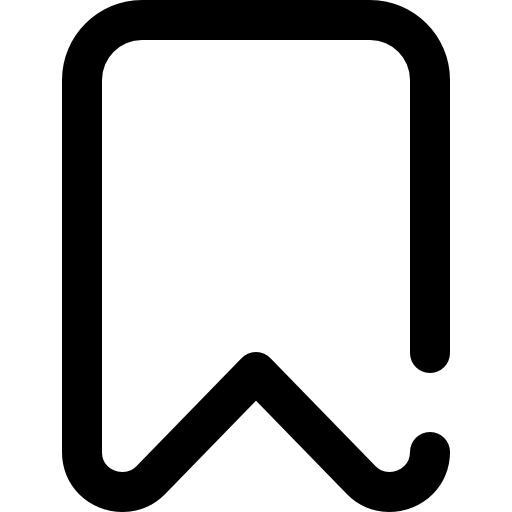 - `<Icon group="ui-interface" name="bookmark" />`
 - 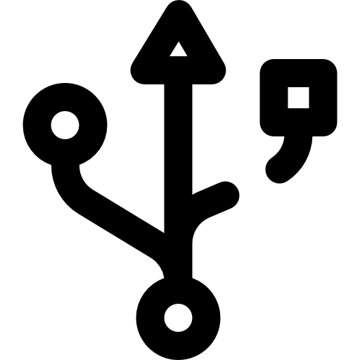 - `<Icon group="ui-interface" name="usb" />`
 -  - `<Icon group="ui-interface" name="mute" />`
 -  - `<Icon group="ui-interface" name="volume" />`
 - 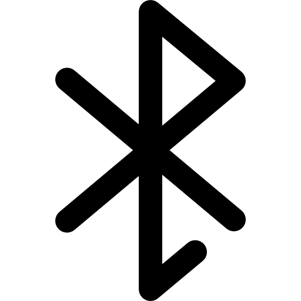 - `<Icon group="ui-interface" name="bluetooth" />`
 -  - `<Icon group="ui-interface" name="email" />`
 -  - `<Icon group="ui-interface" name="chat" />`
 -  - `<Icon group="ui-interface" name="alarm" />`
 -  - `<Icon group="ui-interface" name="edit" />`
 -  - `<Icon group="ui-interface" name="calendar" />`
 - 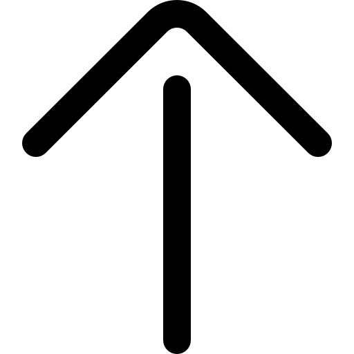 - `<Icon group="ui-interface" name="up-arrow" />`
 -  - `<Icon group="ui-interface" name="menu" />`
 -  - `<Icon group="ui-interface" name="hourglass" />`
 -  - `<Icon group="ui-interface" name="wall-clock" />`
 -  - `<Icon group="ui-interface" name="padlock" />`